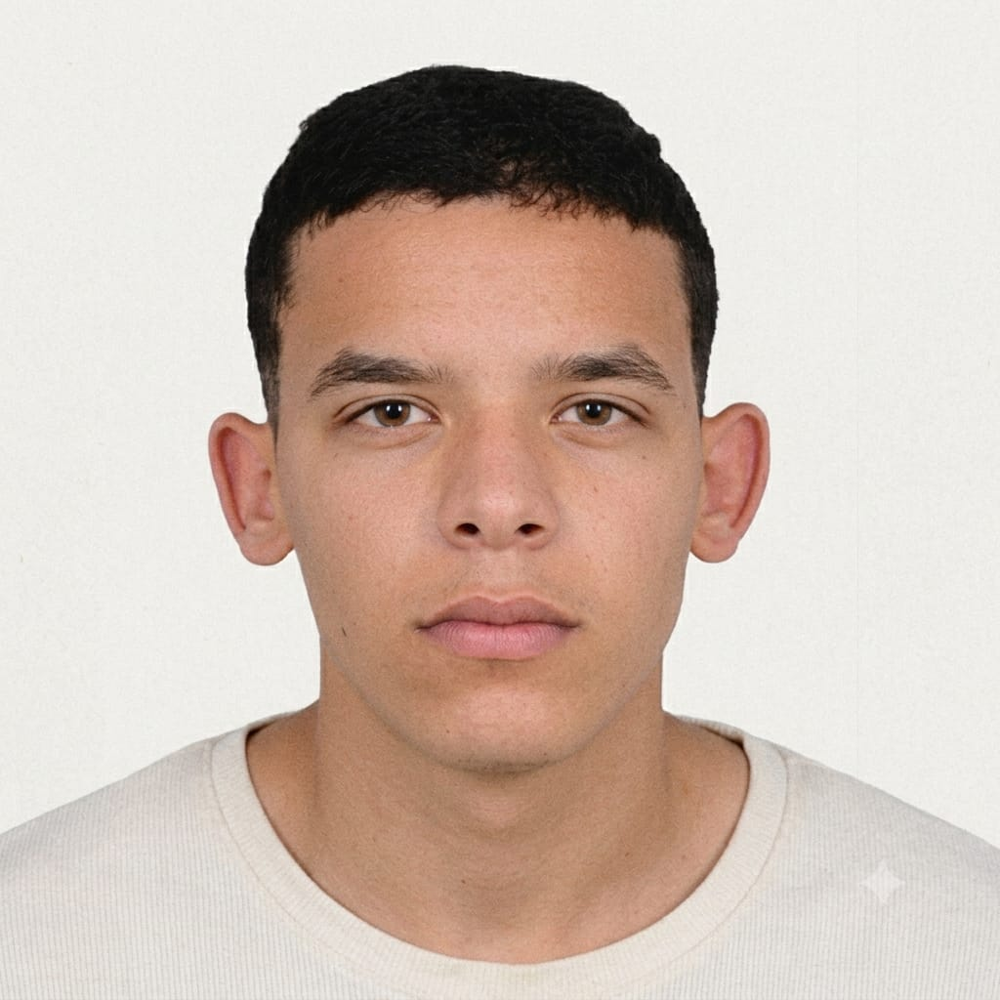

<div align="center">



# Saifeddine Ounissi

**Technicien réseau & cybersécurité** — Médenine, Tunisie

Concevoir des réseaux, les durcir, et automatiser ce qui est répétitif entre les deux.

[Source](https://github.com/saif-infinity/potfolio) · [LinkedIn](https://linkedin.com/in/saif-eddine-ounissi)

</div>

---

## À propos

Un site portfolio conçu comme une expérience sur une seule page : une ouverture
style terminal qui démarre vers le site principal, un fond à couches CRT avec
shaders GLSL sur mesure, des apparitions de sections au défilement, et une presse
à certificats 3D rendue avec Three.js.

Le contenu est un portfolio personnel pour un technicien réseau et
cybersécurité : formation initiale, langues de travail, formations suivies et
projets concrets.

## Points clés

**Couche CRT en WebGL natif.** Le fond terminal n'est ni une vidéo ni un canevas
de simulation. `crtRenderer.ts` compile des shaders vertex et fragment
personnalisés contre un contexte WebGL brut, et rend le texte via un canevas 2D
hors écran : la courbure des lignes de balayage, la vignette et la lueur des
phosphores sont donc calculées pixel par pixel.

**Presse à certificats en Three.js.** Les formations sont présentées comme des
certificats physiques sur une presse que l'on peut faire tourner au glisser.
La géométrie, l'éclairage et l'animation de tracé `pathLength` sont pilotés
directement ; la ligne de date s'adapte aux formations sans année confirmée.

**Des apparitions qui ne peuvent pas rester bloquées.** Les apparitions au
défilement demandent « *la position de défilement a-t-elle dépassé cet
élément ?* » plutôt que « *est-il visible maintenant ?* » — voir
[Animations d'apparition](#animations-dapparition) ci-dessous.

**Un contenu honnête.** Les formations suivies sont présentées comme telles, et
non comme des certifications obtenues. Les dates n'apparaissent que lorsque le
CV les confirme ; sinon elles sont omises plutôt que déduites.

## Stack technique

| Couche | Choix |
| --- | --- |
| Framework | [Next.js](https://nextjs.org) 14.2 (App Router) |
| UI | [React](https://react.dev) 18.3 + TypeScript 5 (strict) |
| Styles | [Tailwind CSS](https://tailwindcss.com) 3.4 |
| Animation | [Framer Motion](https://www.framer.com/motion/) 11.18 |
| 3D | [Three.js](https://threejs.org) 0.186 |
| Graphismes | WebGL brut + shaders GLSL |
| Typographie | [Inter Tight](https://rsms.me/inter/) & [EB Garamond](https://fonts.google.com/specimen/EB+Garamond) via `next/font` |

## Démarrage

Nécessite **Node.js 18.17+** (développé sur v24).

```bash
git clone https://github.com/saif-infinity/potfolio.git
cd potfolio
npm install
npm run dev
```

Ouvrir [http://localhost:3000](http://localhost:3000).

### Scripts

| Commande | Description |
| --- | --- |
| `npm run dev` | Démarrer le serveur de développement |
| `npm run build` | Build de production |
| `npm start` | Servir le build de production |
| `npm run lint` | Lancer ESLint |
| `npx tsc --noEmit` | Vérifier les types sans émettre |

## Routes

| Route | Description |
| --- | --- |
| `/` | Ouverture terminal — passe automatiquement à `/home` après 6 s |
| `/home` | Le portfolio |

## Modifier le contenu

Tous les textes, la formation, les cours, les projets et les coordonnées sont
réunis dans un seul fichier :

```
src/data/site.ts
```

`Certificate.year` est optionnelle par conception. Une formation dont le CV ne
confirme pas la date s'affiche sans année plutôt qu'avec une année devinée, et
la presse comme le pied de page s'adaptent en conséquence.

## Structure du projet

```
src/
├── app/
│   ├── layout.tsx          # Polices, métadonnées, coquille globale
│   ├── page.tsx            # Route d'ouverture terminal
│   └── home/page.tsx       # Route du portfolio
├── components/
│   ├── crt/                # CRT WebGL, shaders, ouverture terminal
│   ├── certificates/       # Presse Three.js + géométrie des certificats
│   ├── motion/Reveal.tsx   # Primitives d'apparition au défilement
│   ├── sections/           # Sections de la page
│   ├── hero/               # En-tête
│   ├── navigation/         # Barre de navigation
│   └── background/         # Champ de particules
├── data/site.ts            # Source unique du contenu
└── lib/fonts.ts            # Configuration next/font
```

## Animations d'apparition

Les primitives d'apparition de `src/components/motion/Reveal.tsx` évitent
délibérément le `whileInView` avec `once: true` de Framer Motion.

`InViewFeature` retourne tôt sauf si l'état d'intersection *change*
réellement :

```js
if (this.isInView === isIntersecting) return;
```

Si un élément traverse entièrement la fenêtre entre deux callbacks
`IntersectionObserver` délivrés, Framer ne voit que l'état final et jamais le
`true` transitoire — l'apparition est donc manquée définitivement. Sous
pression du thread principal, c'est facile à déclencher : un défilement brutal
de 900 px fait traverser toute la zone de déclenchement à un titre de section
en environ 58 ms, soit plus vite que ce que saute un intervalle
d'échantillonnage bon marché.

`useRevealOnScroll` compare plutôt le `scrollY` cumulé à la position de
l'élément dans le document. Cette comparaison est **monotone** — une fois que
la fenêtre a dépassé un élément, elle le reste — donc aucun saut de distance ne
peut la manquer. Sonder « est-il visible maintenant » ne constituerait pas un
correctif : `IntersectionObserver` comme `requestAnimationFrame` dépendent du
thread principal, et l'échantillonnage a des trous par définition.

L'animation elle-même est inchangée : même durée, même easing, même décalage
(stagger). Sous `prefers-reduced-motion`, le contenu s'affiche immédiatement
sans transformation.

## Notes

- Les cours sont des formations suivies, pas des certifications obtenues.
- Les jauges de langues sont qualitatives et purement visuelles — aucune valeur
  n'est affichée.
- Les polices sont chargées et attendues avant que la couche texte WebGL ne
  dessine.

---

<div align="center">
Réalisé avec soin par <strong>Saifeddine Ounissi</strong>
</div>